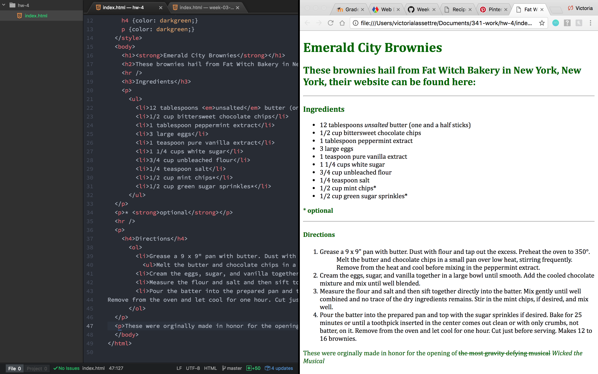
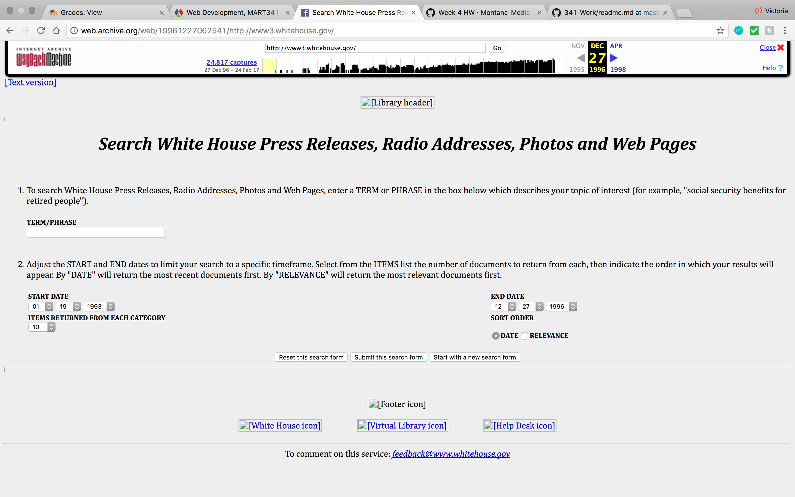
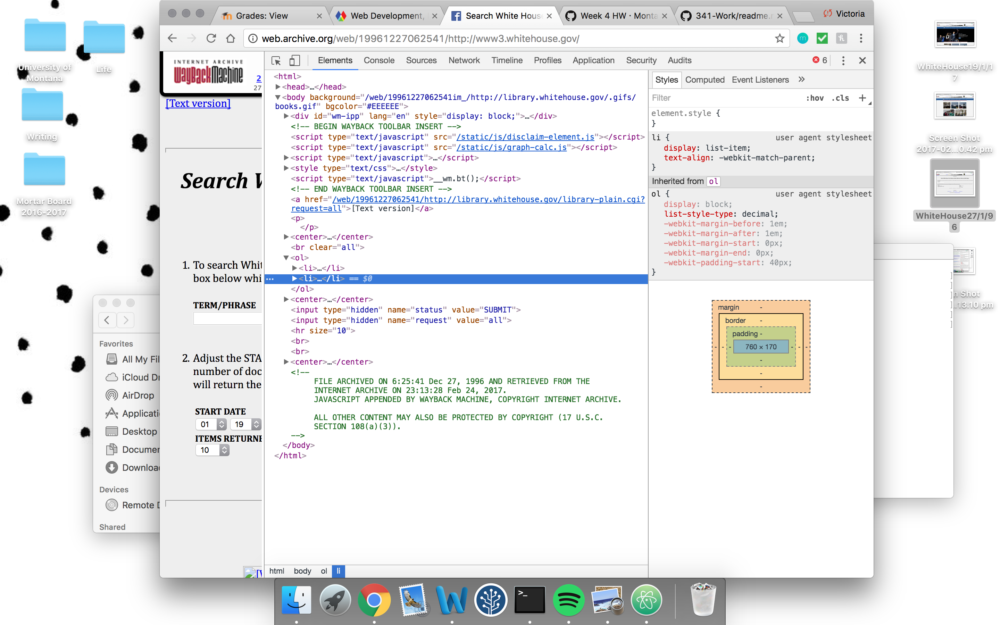
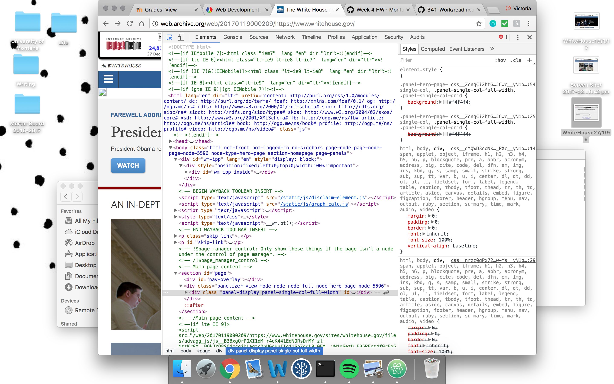
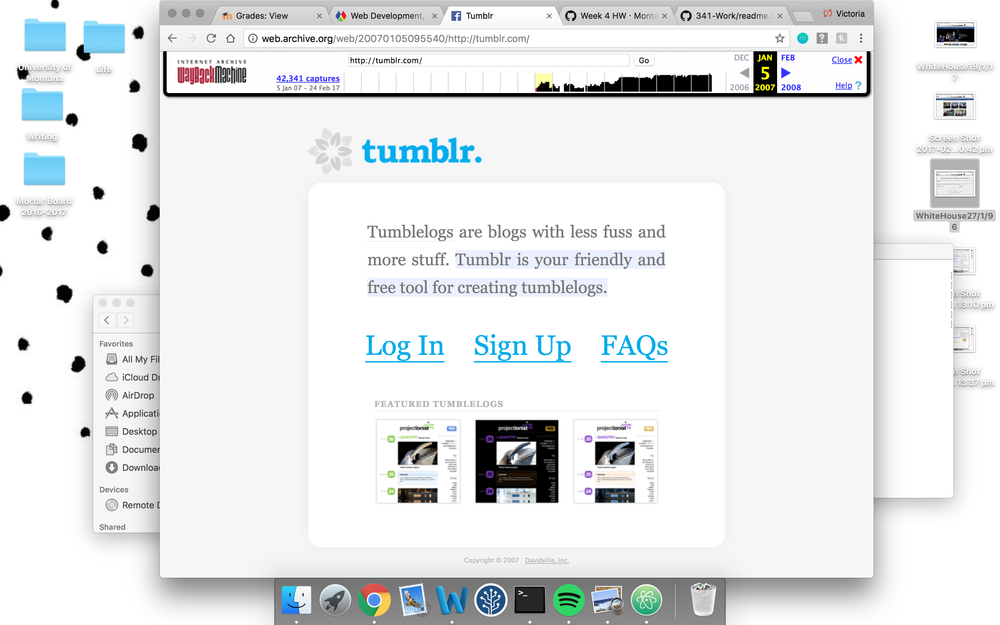
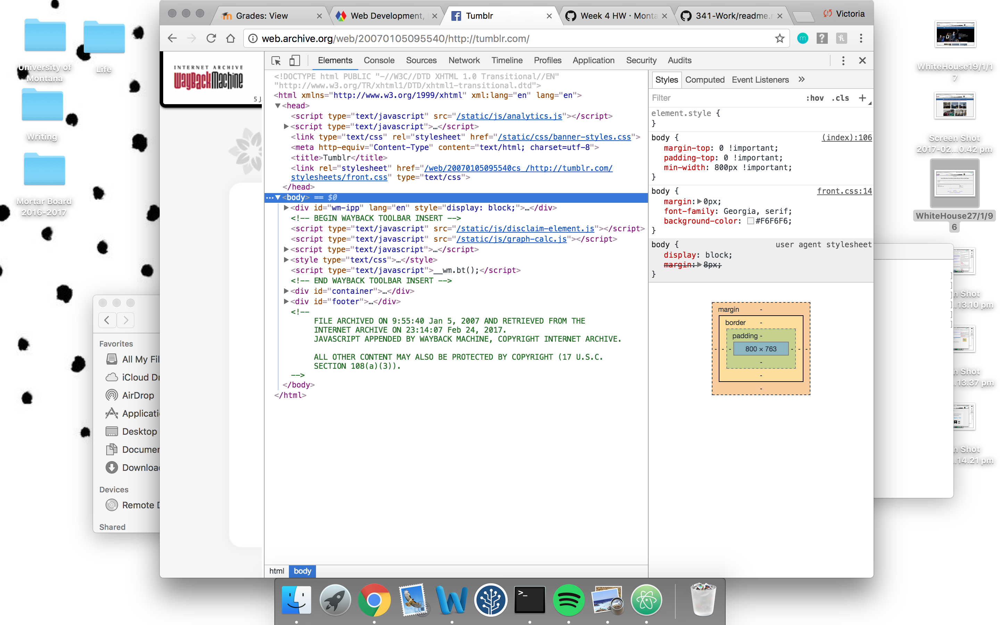
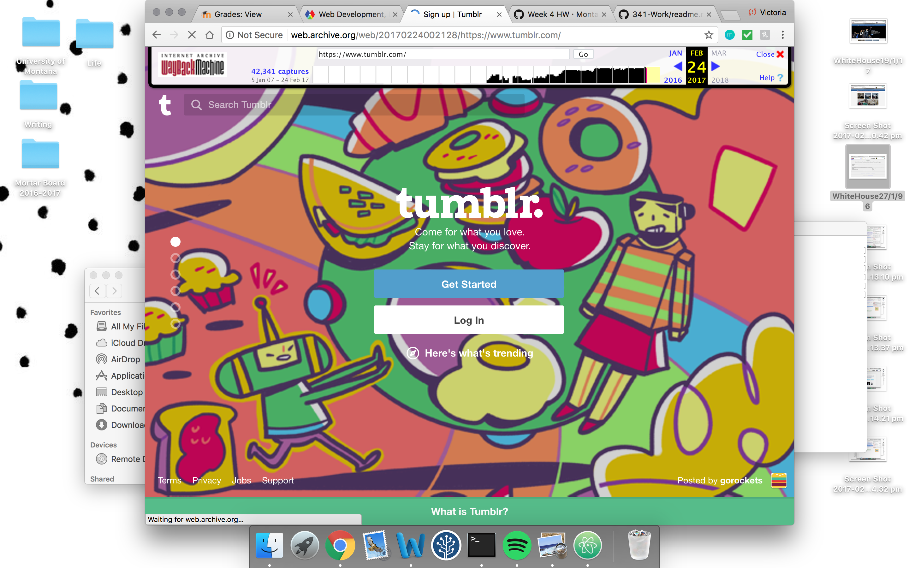
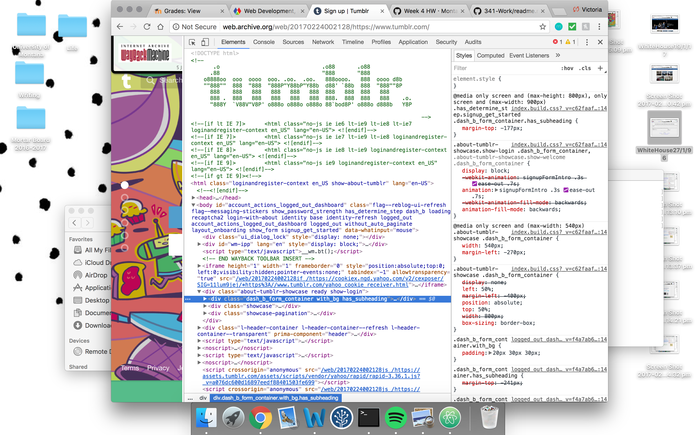

# Week 4 Report
  Victoria Lassettre
## This week's summary
- Read through this week's webpages and read the assigned chapters.
- I fiddled around on websites such as [Youtube](www.youtube.com) and [Facebook](www.facebook.com) to take a closer look at the underlying codes of complex sites.
- I then created ``index.html`` and selected my recipe for the week.
- I then created a second page and linked it to the one mentioned above and to my original webpage from last week.
- After all of that I created the ``readme.md`` for this week's report.

## Trials and Tribulations
- This week wasn't too bad, my biggest problem was making sure I included the '/' after I finished writing.

## Looking Ahead
- I am looking forward to being able to add pictures and overall making the website "less bland."

## Wayback Machine

The first website I looked at was the ``White House`` on the dates of December 27, 1996 and January 19, 2017.

December 27, 1996:

January 19, 2017:

As you can see the White House web page has changed quite a bit since 1996.

The second website I chose to look at was ``tumblr`` as I knew it was a younger website--it just celebrating its 10th birthday this past month--and would be more complex than the 20 year old White House Page.

January 5, 2007:

February 23, 2017:

Tumblr has certainly far more creative and colorful in the past ten years and has a much more stream line process of logging in or creating an account.

I will be interested to see how websites further progress in the coming years.
