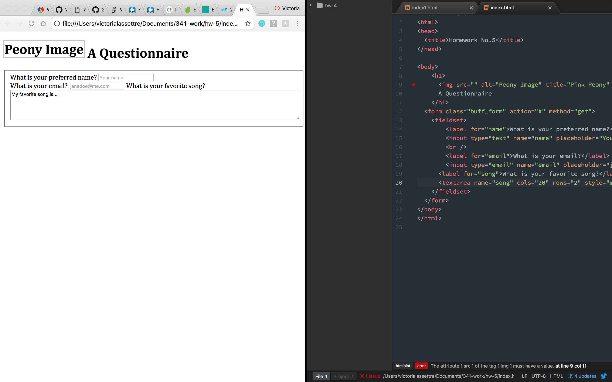
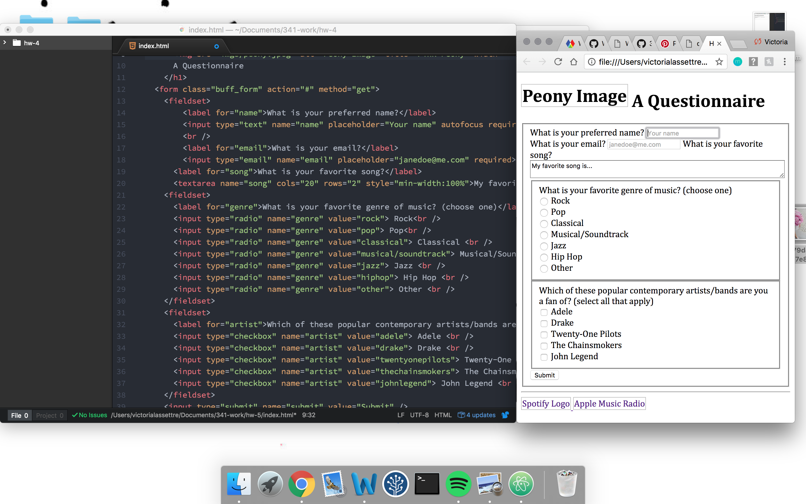
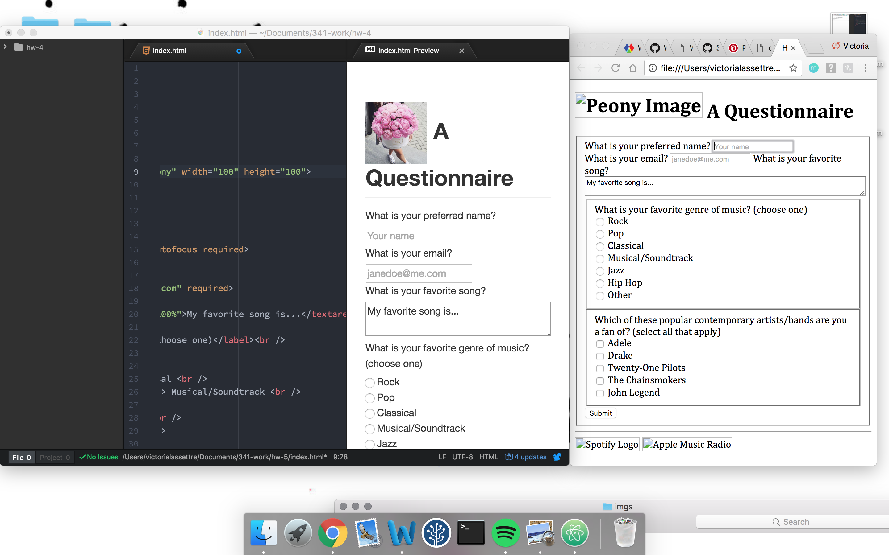
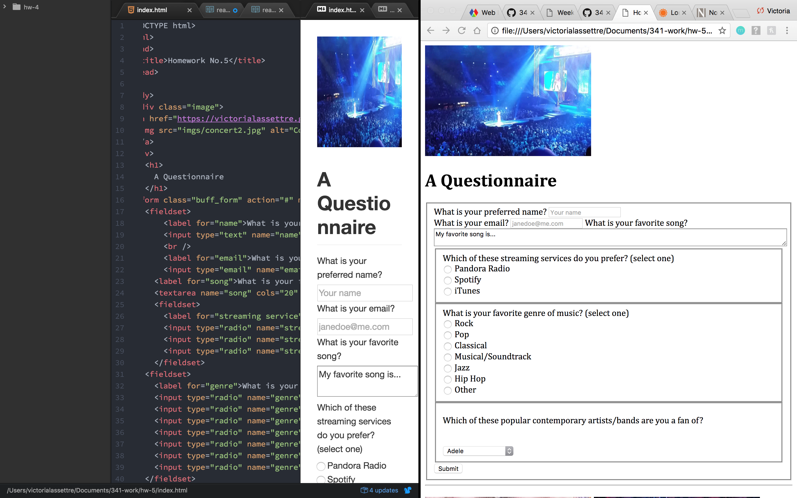

# Week 5 Write up
## Victoria Lassettre

### Summary of the Week:
- I read through the lecture pages and the Duckett book along with all of the extra webpages linked throughout the course.
- I then created a new directory for this week's assignment along with the index.html and readme.md.
- While building this week's form I also created a new child folder for all of the images used.
- ``Google`` was a very useful tool as usual as I nativated my way through building the form.
- Here are some screenshots of my progress--as you can see I changed stuff around a couple of times as I tried to decide what I wanted to use:

### Trials and Triumphs:
- I didn't have too many problems other than having to double check that all of my tags matched up. Additionally, the reading took a bit longer than expected so I didn't have as much time as I would have like to work on creating this week's form.

### Looking Ahead:
- I will definitely need to work more with building forms and the various questions you can create.
- I am looking forward to making future webpages unique as we continue to build our knowledge of web design.

### Image sources:
[Blue tinted concert image](https://i.ytimg.com/vi/4QyijKASQhk/maxresdefault.jpg)

[Well-lit concert image](https://pixabay.com/p-923245/?no_redirect)

[Colorful concert image](http://az616578.vo.msecnd.net/files/2016/05/14/6359882318083715301879787974_concert.jpg)
