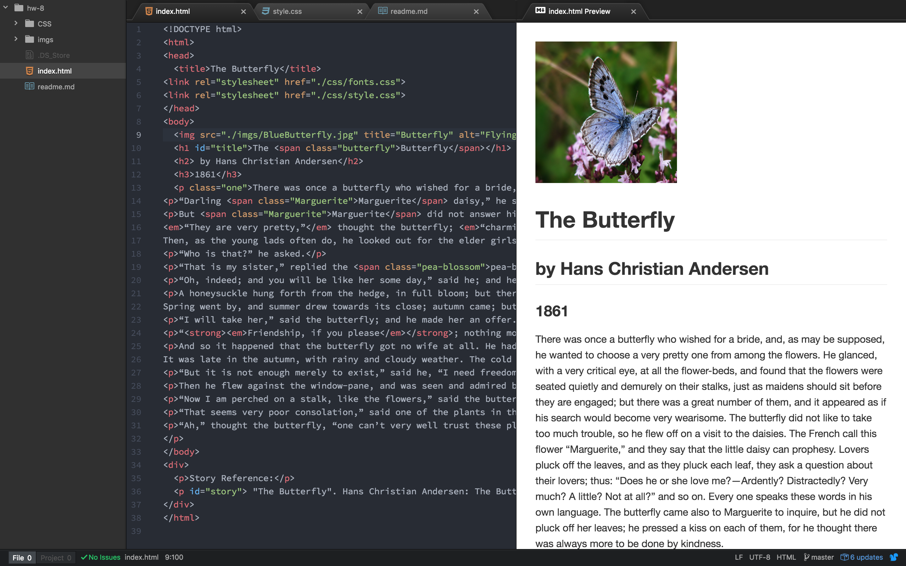

# Week 8 Write-up
## Victoria Lassettre
### Summary
- I read through all of the reading for week 7 and week 8 to prepare myself for the upcoming work.
- I then created my `index.html`, `CSS folder`, and `imgs folder`.
- It took me a while to figure out which short story I wanted to use as I knew which author to pull from, Hans Christian Andersen, but not which of his numerous works.
- For my `index.html` I first wrote the story down (more like copied and pasted it) before formatting it correctly and then adding the style and fonts thanks to CSS.

### Reasons behind my choices: Color scheme
- This week I chose to work with a softer cholor scheme as it tied in with the imagery of springtime-blossoms and butterflies. I stuck with the overall black color for font as a paler neutral did not stand out as well as black.
### Trials and Tribulations
- I didn't face any difficulties other than trying to make sure I had all met the criteria for this week's assignment (which I hopefully did).
- What I did face was the tribulation of doing all of my work in a single time block, which made the process rather tedious.
