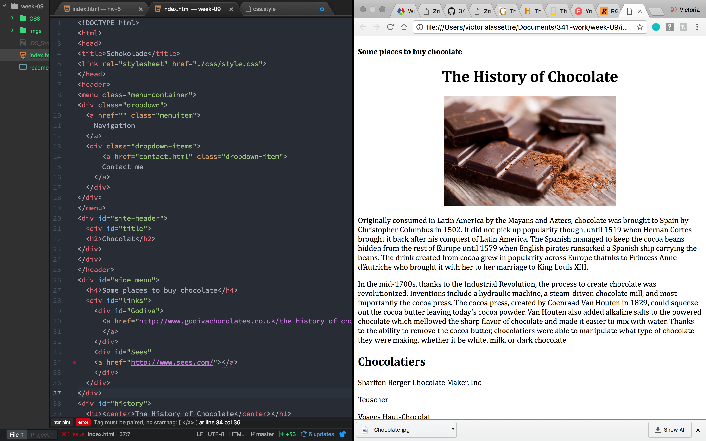
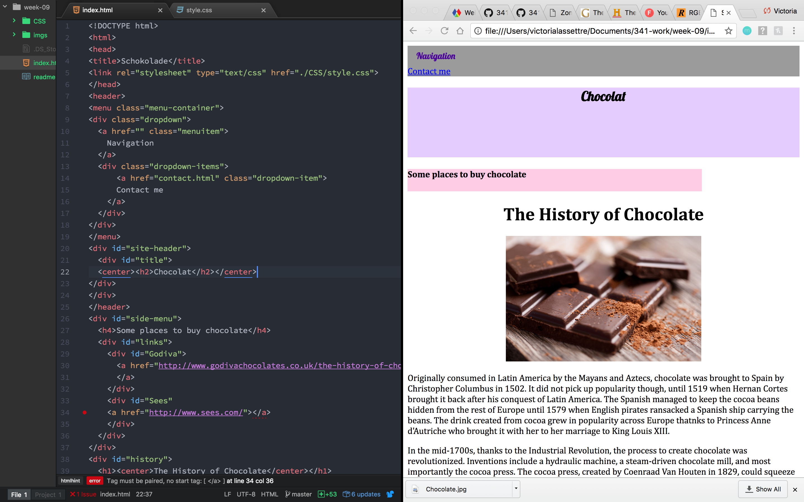

# Weekly Report
## Week 9
#### Victoria Lassettre
### Summary
- I first looked at what the homework assignment so I knew what to look for and pay attention to in the lecture notes.
- I then created my directory for the week and created the following: `index.html`, `contact.html`, `css.style`, and the `imgs folder`.
- I finished the `index.html` first along with the `contact.html`. Then I searched for the photographs I wanted and placed them within the `imgs folder`.
- I then finished the assigment with the `css.style` which probably took the longest to complete out of all of the components for this week's assignment.
- I created a `readme.md` to finish off the week.

### Reasons for my Selections
- Since the Easter holiday is right around the corner I decided to play with the pastel colors to present the information on the page.
- Additionally when I tried to do darker background colors and lighter font colors it didn't work as well and almost made it harder to read.
### Difficulties
- I didn't face too many difficulties other than keeping track of the `
..
` tags, that ended up being rather confusing by the end.
- Also keeping track of the `css.style` coding was annoying as I did it the hard way by creating the entire `index.html` before editing the `css.style`.
### Looking Ahead
- I am looking forward to continuing on smoothing out the process of creating a website and smoothing out the appearance of the site as well.
### Resources
- [Godiva](http://www.godivachocolates.co.uk/the-history-of-chocolate-europe.html)
- [History](http://www.history.com/news/hungry-history/the-sweet-history-of-chocolate)
